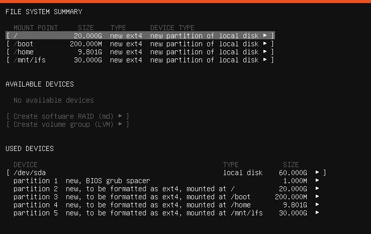

Summary.

<!--more-->

# Preparing the Host System
## Hardware:
- CPU 4 cores
- RAM 16GB RAM
- OS: Ubuntu Server 18.04.6 LTS
## Software:
```
    bash>=3.2
    binutils>=2.13.1
    bison>=2.7
    coreutils>=6.9
    diffutils>=2.8.1
    findutils>=4.2.31
    gawk>=4.0.1
    gcc>=5.1
    grep>=2.5.1
    gzip>=1.3.12
    linux-kernel>=3.2
    m4>=1.4.10
    make>=4.0
    patch>=2.5.4
    perl>=5.8.8
    python>=3.4
    sed>=4.1.5
    tar>=1.22
    texinfo>=4.7
    xz>=5.0.0
```
- Run the following script to see whether the host system has all the appropriate packages
```
#!/bin/bash
# Simple script to list version numbers of critical development tools
export LC_ALL=C
bash --version | head -n1 | cut -d" " -f2-4
MYSH=$(readlink -f /bin/sh)
echo "/bin/sh -> $MYSH"
echo $MYSH | grep -q bash || echo "ERROR: /bin/sh does not point to bash"
unset MYSH

echo -n "Binutils: "; ld --version | head -n1 | cut -d" " -f3-
bison --version | head -n1

if [ -h /usr/bin/yacc ]; then
    echo "/usr/bin/yacc -> `readlink -f /usr/bin/yacc`";
elif [ -x /usr/bin/yacc ]; then
    echo yacc is `/usr/bin/yacc --version | head -n1`
else
    echo "yacc not found"
fi

echo -n "Coreutils: "; chown --version | head -n1 | cut -d")" -f2
diff --version | head -n1
find --version | head -n1
gawk --version | head -n1

if [ -h /usr/bin/awk ]; then
    echo "/usr/bin/awk -> `readlink -f /usr/bin/awk`";
elif [ -x /usr/bin/awk ]; then
    echo awk is `/usr/bin/awk --version | head -n1`
else
    echo "awk not found"
fi

gcc --version | head -n1
g++ --version | head -n1
grep --version | head -n1
gzip --version | head -n1
cat /proc/version
m4 --version | head -n1
make --version | head -n1
patch --version | head -n1
echo Perl `perl -V:version`
python3 --version
sed --version | head -n1
tar --version | head -n1
makeinfo --version | head -n1 # texinfo version
xz --version | head -n1

echo 'int main(){}' > dummy.c && g++ -o dummy dummy.c
if [ -x dummy ]
    then echo "g++ compilation OK";
    else echo "g++ compilation failed"; fi
rm -f dummy.c dummy
```
Since I'm using ubuntu-server-18.04.6 lts, We'll have to install few more packages
```
    sudo apt install -y g++ gcc texinfo make m4 bison
```
Also, We need to create a symbolic link (or hard link) for /bin/sh to /bin/bash
```
    sudo unlink /bin/sh
    sudo ln -s /bin/bash /bin/sh
```

# Stage 1: 
**_NOTE:_** Procedures performed as root user must have the LFS env variable set FOR THE ROOT USER.
```
    sudo -i
    export LFS=/mnt/lfs # can add this to root .bashrc file
```
## Create a new partition for LFS

```
/ (root partition): 20G
/boot : 200MiB
/home: 9.8GiB
/mnt/lfs: partition for LFS - 30GiB
```
## Install packages and patches:
```
    mkdir -v $LFS/sources
    chmod -v a+wt $LFS/sources
    cd $LFS/sources
    wget https://mirror-hk.koddos.net/lfs/lfs-packages/lfs-packages-11.3.tar
    tar -xvf lfs-packages-11.3.tar
    mv 11.3/* .
```

## Create a limited directory layout:
```
    mkdir -pv $LFS/{etc,var} $LFS/usr/{bin,lib,sbin}
    for i in bin lib sbin; do
        ln -sv usr/$i $LFS/$i
    done
    ## '/mnt/lfs/bin' -> 'usr/bin'
    ## '/mnt/lfs/lib' -> 'usr/lib'
    ## '/mnt/lfs/sbin' -> 'usr/sbin'

    case $(uname -m) in
        x86_64) mkdir -pv $LFS/lib64 ;;
    esac
    ## mkdir: created directory '/mnt/lfs/lib64'

    mkdir -pv $LFS/tools
```

## Adding LFS User:
```
    groupadd lfs
    useradd -s /bin/bash -g lfs -m -k /dev/null lfs
```
Explain:
- -s /bin/bash: default shell = bash
- -g lfs: add to group lfs
- -m: create home dir for this user
- -k /dev/null: by default it will copy files from /etc/skel folder (which contains .bashrc, etc), here we override with /dev/null.

- Grant lfs full access to all 
```
    chown -v lfs $LFS/{usr{,/*},lib,var,etc,bin,sbin,tools}
    case $(uname -m) in 
        x86_64) chown -v lfs $LFS/lib64 ;;
    esac
```
- Setting up environment:
```
    su - lfs
    cat > ~/.bash_profile << "EOF"
    exec env -i HOME=$HOME TERM=$TERM PS1='\u:\w\$ ' /bin/bash
    EOF    
```
```
cat > ~/.bashrc << "EOF"
set +h
umask 022
LFS=/mnt/lfs
LC_ALL=POSIX
LFS_TGT=$(uname -m)-lfs-linux-gnu
PATH=/usr/bin
if [ ! -L /bin ]; then PATH=/bin:$PATH; fi
PATH=$LFS/tools/bin:$PATH
CONFIG_SITE=$LFS/usr/share/config.site
export LFS LC_ALL LFS_TGT PATH CONFIG_SITE
EOF
```
Explain:
- set +h: disable "hashall" option. This option causes the shell to remember the full path to executable commands that are run in the shell session. Switching off the hash function
forces the shell to search the PATH whenever a program is to be run.As such, the shell will find the newly compiled
tools in $LFS/tools/bin as soon as they are available without remembering a previous version of the same program
provided by the host distro, in /usr/bin or /bin.
- umask 022: set default file permissions for newly created filese and directories. The mask is subtracted from the default permissions of 666 for files and 777 for directories. `022` means write permission (2) is removed from the group and others. => `644` for new files, `755` for new directories.
##
# Stage 2:
**_NOTE:_**

# Stage 3:
**_NOTE:_**
